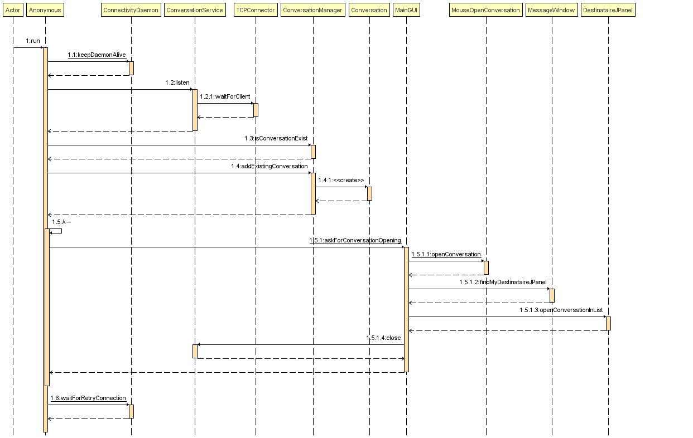
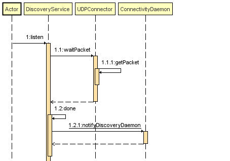

# UML

## Final

### Class

#### Data Transfer Objects (DTO)

#### Connectivity

### Database

### Use Case

### Sequence

#### ConversationService

#### DiscoveryService

---------

## Drafts (old)

